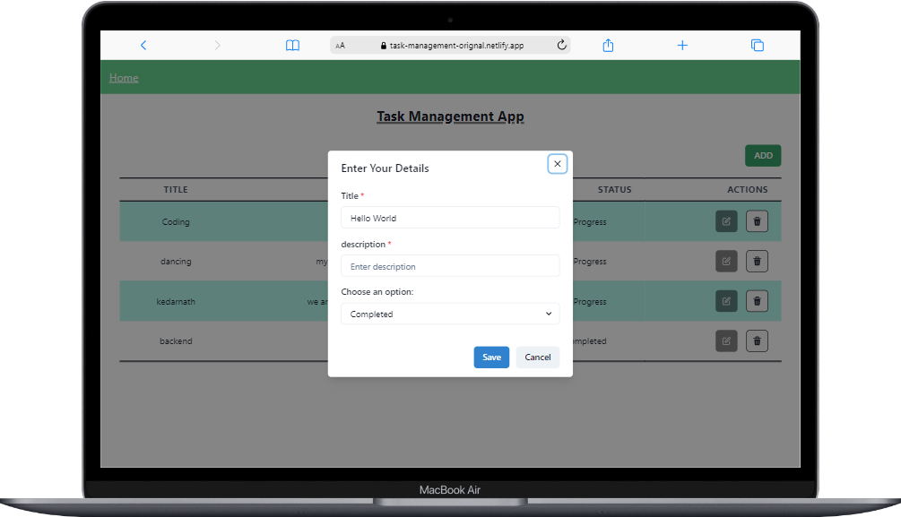
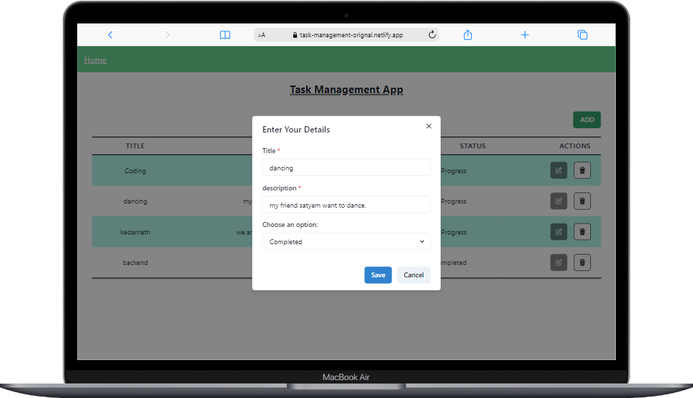
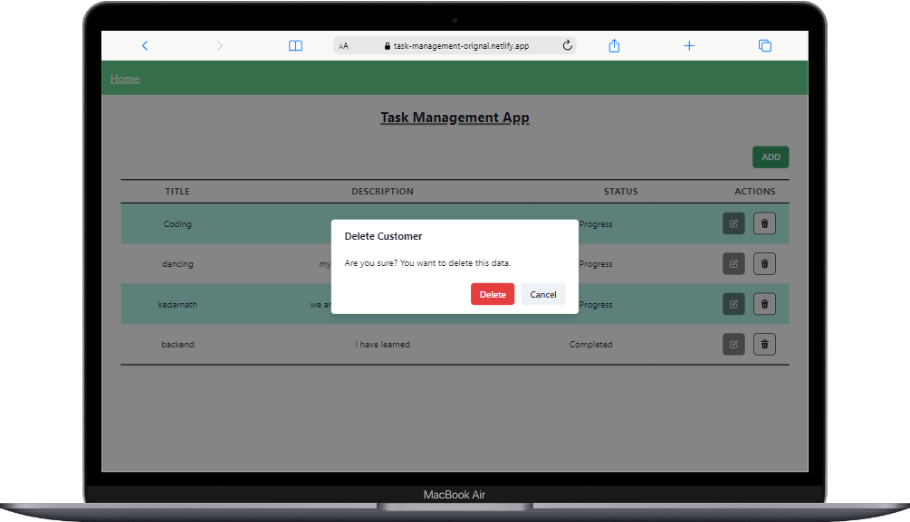
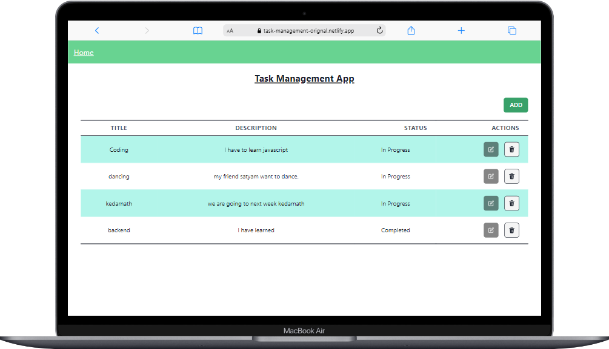

<h1 align="center">Task Management App</h1>

<h3 align="center">It's a Task Management Application</h3>

 

<h2 align="center">🖥️ Tech Stack</h2>

<h4 align="center">Frontend:</h4>

  

  
  
  
  

<h4 align="center">Deployed On:</h4>

  
 

 

## Add Task

 

## Update Task

 

## Delete Task

 

## All Task

 

## Getting Started

-> To get started with the project, follow these steps:

1. Clone the repository to your local machine.
2. Install the required dependencies by running npm install.
3. Start the backend server by running npm run start.
4. Start the frontend server by running npm run start.
5. Open your browser and navigate to http://localhost:3000 to view the app.

# Deployed Link

### Frontend

https://task-management-orignal.netlify.app/
